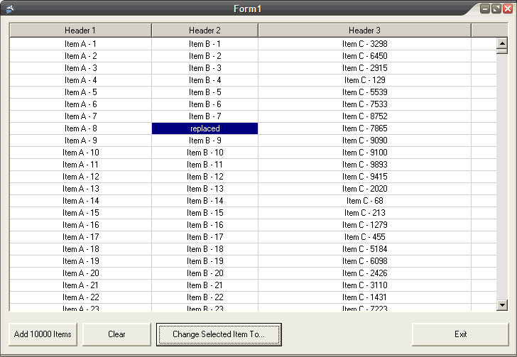



## ucDetailView \- Owner drawn listview

### Description

11/04/07: Fixes by Ed Wilk

03/04/07: ListIndex bugfix. (Thank you Ed Wilk)

29/03/07: Bugfixes.

4th July 06: Added gridlines, sorting &amp; dynamic header resize. In the process of changing to API draw functions. Thanks to TerriTop!

My previous entry used linked listboxes and was too slow when the listcount &gt; 10000 so I started a new, completely different owner drawn project. It's nearly finished but I wanted to find any bugs before I use them in my projects. Please help me complete it!!! (14KB Zip)
 
### More Info
 

             |
---                |---
**Submitted On**   |2007-04-06 16:16:38
**By**             |[AlanMN](https://github.com/Planet-Source-Code/PSCIndex/blob/master/ByAuthor/alanmn.md)
**Level**          |Intermediate
**User Rating**    |4.3 (26 globes from 6 users)
**Compatibility**  |VB 6\.0
**Category**       |[Custom Controls/ Forms/  Menus](https://github.com/Planet-Source-Code/PSCIndex/blob/master/ByCategory/custom-controls-forms-menus__1-4.md)
**World**          |[Visual Basic](https://github.com/Planet-Source-Code/PSCIndex/blob/master/ByWorld/visual-basic.md)
**Archive File**   |[ucDetailVi2059614102007\.zip](https://github.com/Planet-Source-Code/alanmn-ucdetailview-owner-drawn-listview__1-65840/archive/master.zip)

